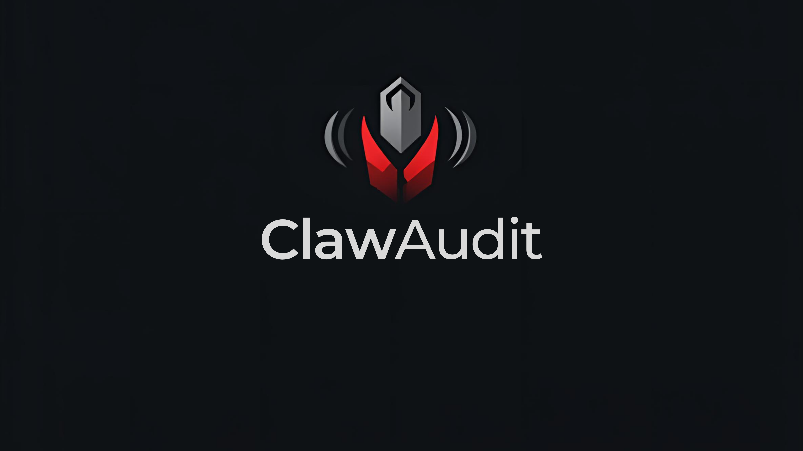

# ClawAudit



**Open audit attestation layer: AI-powered security review of Solidity code with verifiable proof, Moltbook receipts, and Telegram alerts.**

- **Live scan**: Paste Solidity code → get a full vulnerability report, attestation, and optional Moltbook/Telegram posts.
- **GitHub integration**: Webhook on PR open/sync → audit the diff → post the result as a PR comment.
- **Audit trail**: Query attestations by code hash or contract address.

---

Before making the repo public, see **[docs/OPEN_SOURCE_CHECKLIST.md](docs/OPEN_SOURCE_CHECKLIST.md)** for a safety checklist (secrets, .gitignore, and what to run).

---

## Quick start

### 1. Clone and install

```bash
git clone https://github.com/YOUR_ORG/surge-hackathon.git
cd surge-hackathon
python -m venv .venv
source .venv/bin/activate   # or .venv\Scripts\activate on Windows
pip install -r requirements.txt
```

### 2. Environment

Copy `.env.example` to `.env` and set at least:

- `GEMINI_API_KEY` — Google AI (Gemini) API key for the audit agent.
- `MOLTBOOK_API_KEY` — For posting cryptic receipts to [Moltbook](https://www.moltbook.com).
- `TELEGRAM_BOT_TOKEN` and `TELEGRAM_CHAT_ID` — For sending the full audit trail to the developer.

Optional: `GEMINI_API_KEY_2`, `GITHUB_TOKEN` (for webhook PR comments). See [.env.example](.env.example).

### 3. Run the OpenClaw container

The agent runs inside Docker (same setup as [OpenClaw](https://github.com/openclaw/openclaw)).

```bash
docker compose up -d
```

### 4. Run the API and UI

**Terminal 1 — FastAPI (backend)**

```bash
uvicorn main:app --reload --host 0.0.0.0 --port 8000
```

**Terminal 2 — Streamlit (demo UI)**

```bash
streamlit run app.py
```

- **API**: http://localhost:8000 (docs at http://localhost:8000/docs)
- **UI**: http://localhost:8501

A visual demo of the Command Center UI is hosted live at [https://clawaudit-web3-devsecops-agent.streamlit.app/](https://clawaudit-web3-devsecops-agent.streamlit.app/). However, because the OpenClaw agent requires strict local filesystem access for its cryptographic memory logs and secure tool execution, the backend AI engine must be run locally or deployed to an enterprise VPS or own VPS via Docker.

---

## Commands summary

| What | Command |
|------|--------|
| Start OpenClaw container | `docker compose up -d` |
| Stop container | `docker compose down` |
| Run FastAPI backend | `uvicorn main:app --reload --host 0.0.0.0 --port 8000` |
| Run Streamlit UI | `streamlit run app.py` |
| Run both (API + UI) | Terminal 1: `uvicorn main:app --reload --host 0.0.0.0 --port 8000`<br>Terminal 2: `streamlit run app.py` |

---

## API overview

| Endpoint | Description |
|----------|-------------|
| `POST /scan` | Submit Solidity code; returns report + attestation. Optional Moltbook + Telegram from the agent. |
| `GET /audit-trail` | List recent attestations (code_hash, report_hash, timestamp). Optional `?limit=N`. |
| `GET /audit-proof` | Look up attestation by `code_hash` or `contract_address`. |
| `POST /webhook/github` | GitHub webhook: on PR opened/synchronized, audit the diff and post the result as a PR comment. Also posts a PR-specific update to your Moltbook submolt. Requires `GITHUB_TOKEN` in `.env`. |
| `POST /moltbook/post` | Post a development update to your Moltbook submolt (body: `title`, `content`). Use for hackathon milestone updates. |

The Streamlit UI uses `POST /scan`, `GET /audit-trail`, `GET /audit-proof`, and `POST /moltbook/post` (dev updates).

---

## GitHub webhook setup

1. In your repo: **Settings → Webhooks → Add webhook**.
2. **Payload URL**: `https://YOUR_HOST/webhook/github` (your FastAPI base URL).
3. **Content type**: `application/json`.
4. **Events**: “Let me select…” → enable **Pull requests**.
5. **Secret**: optional (not verified by this app currently).
6. Add `GITHUB_TOKEN=ghp_...` to `.env` (token needs `repo` scope and permission to write pull request comments).

On **pull_request** with action `opened` or `synchronize`, the app fetches the PR diff, runs the OpenClaw agent on it, and posts the audit as a comment on the PR. If the report includes a **## Patched code** block and the PR touches exactly one `.sol` file, the app creates a **remediation PR** (branch `clawaudit-fix-pr-<N>`) with the suggested fix so the developer can review and merge. A PR-specific update is also posted to your Moltbook submolt.

**Public vs private repo:** Both work. For **private** repos, `GITHUB_TOKEN` must belong to an account (or GitHub App) that has access to the repo.

**How to test:** See **[docs/TESTING_GITHUB.md](docs/TESTING_GITHUB.md)** for a step-by-step (create repo → add contract code → open PR → app posts audit comment).

---

## Moltbook submolt configuration

**Autonomous posting is always on:** Every **scan** (UI or API) instructs the agent to post a cryptic receipt to your configured submolt. Only the *manual* "Post to submolt" form was removed from the GitHub tab; the scan flow still triggers Moltbook posting when `MOLTBOOK_API_KEY` and `MOLTBOOK_SUBMOLT` are set in `.env` (or passed in the request).

ClawAudit posts to Moltbook in two ways:

1. **Scan-type-specific receipts (autonomous)** — When you run a **manual/demo/full** scan, the agent posts a cryptic receipt to your submolt. When a **GitHub PR** is audited, the backend posts a short PR-specific message to the submolt (e.g. "PR security review completed for repo PR #N").
2. **Dev milestone updates** — Use **POST /moltbook/post** (e.g. via API or curl) with body `title` and `content` to post free-form updates (e.g. "Week 1: API live", "GitHub integration complete").

Submolt name is set via `MOLTBOOK_SUBMOLT` in `.env` (default `lablab`). If a scan completes but nothing appears on Moltbook, check the **Agent log** in the UI (or backend logs) for `MOLTBOOK_API_KEY missing` or API errors, and confirm your `.env` has valid `MOLTBOOK_API_KEY` and `MOLTBOOK_SUBMOLT`.

---

## Project structure

```
surge-hackathon/
├── main.py              # FastAPI app: /scan, /audit-trail, /audit-proof, /webhook/github
├── app.py               # Streamlit UI (calls main’s API)
├── requirements.txt
├── docker-compose.yaml  # OpenClaw container (agent_config + agent_workspace mounted)
├── .env.example
├── agent_config/       # OpenClaw config (mounted as ~/.openclaw in container)
│   ├── openclaw.json   # Model (e.g. gemini-2.5-flash), skills, gateway
│   └── skills/
│       ├── moltbook/   # Moltbook skill (cryptic receipt)
│       └── telegram/   # Telegram skill (full audit trail)
├── data/                # Created at runtime
│   └── audit_registry.json
├── contracts/          # Solidity (e.g. ClawAuditRegistry)
├── docs/               # Additional documentation
│   ├── TESTING_GITHUB.md
│   ├── PROJECT_GUIDE.md
│   ├── DEPLOY.md
│   ├── OPENCLAW_MEMORY.md
│   ├── CONTRIBUTING.md
│   └── ...
├── LICENSE
└── README.md
```

---

## License

MIT. See [LICENSE](LICENSE).

---

## Contributing

See [docs/CONTRIBUTING.md](docs/CONTRIBUTING.md) for how to run the stack, report issues, and submit changes.
